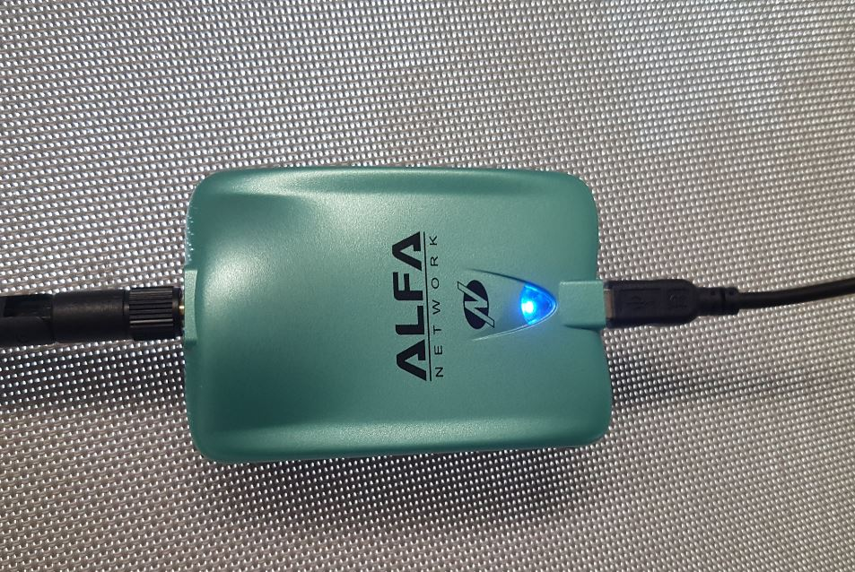

# Alfa Networks AWUS036NH



## Notes

High powered card running at 1000mW  
Great for powering YAGI antennas  
This is the N version of AWUS036H and supports B,G and N 
The device is advertised as 2000mW (~33dBm) however the Linux database usually limits this to 1000mw (20dBm) for legal reasons  

More Info: [Wiki Dev](https://wikidevi.com/wiki/ALFA_Network_AWUS036NH)

## Specs

```
$ iw list 
```

```
Wiphy phy1
        max # scan SSIDs: 4
        max scan IEs length: 2257 bytes
        Retry short long limit: 2
        Coverage class: 0 (up to 0m)
        Device supports RSN-IBSS.
        Supported Ciphers:
                * WEP40 (00-0f-ac:1)
                * WEP104 (00-0f-ac:5)
                * TKIP (00-0f-ac:2)
                * CCMP (00-0f-ac:4)
                * 00-0f-ac:10
                * GCMP (00-0f-ac:8)
                * 00-0f-ac:9
        Available Antennas: TX 0 RX 0
        Supported interface modes:
                 * IBSS
                 * managed
                 * AP
                 * AP/VLAN
                 * monitor
                 * mesh point
        Band 1:
                Capabilities: 0x17e
                        HT20/HT40
                        SM Power Save disabled
                        RX Greenfield
                        RX HT20 SGI
                        RX HT40 SGI
                        RX STBC 1-stream
                        Max AMSDU length: 3839 bytes
                        No DSSS/CCK HT40
                Maximum RX AMPDU length 32767 bytes (exponent: 0x002)
                Minimum RX AMPDU time spacing: 2 usec (0x04)
                HT TX/RX MCS rate indexes supported: 0-7, 32
                Bitrates (non-HT):
                        * 1.0 Mbps
                        * 2.0 Mbps (short preamble supported)
                        * 5.5 Mbps (short preamble supported)
                        * 11.0 Mbps (short preamble supported)
                        * 6.0 Mbps
                        * 9.0 Mbps
                        * 12.0 Mbps
                        * 18.0 Mbps
                        * 24.0 Mbps
                        * 36.0 Mbps
                        * 48.0 Mbps
                        * 54.0 Mbps
                Frequencies:
                        * 2412 MHz [1] (30.0 dBm)
                        * 2417 MHz [2] (30.0 dBm)
                        * 2422 MHz [3] (30.0 dBm)
                        * 2427 MHz [4] (30.0 dBm)
                        * 2432 MHz [5] (30.0 dBm)
                        * 2437 MHz [6] (30.0 dBm)
                        * 2442 MHz [7] (30.0 dBm)
                        * 2447 MHz [8] (30.0 dBm)
                        * 2452 MHz [9] (30.0 dBm)
                        * 2457 MHz [10] (30.0 dBm)
                        * 2462 MHz [11] (30.0 dBm)
                        * 2467 MHz [12] (disabled)
                        * 2472 MHz [13] (disabled)
                        * 2484 MHz [14] (disabled)
        Supported commands:
                 * new_interface
                 * set_interface
                 * new_key
                 * start_ap
                 * new_station
                 * new_mpath
                 * set_mesh_config
                 * set_bss
                 * authenticate
                 * associate
                 * deauthenticate
                 * disassociate
                 * join_ibss
                 * join_mesh
                 * set_tx_bitrate_mask
                 * frame
                 * frame_wait_cancel
                 * set_wiphy_netns
                 * set_channel
                 * set_wds_peer
                 * probe_client
                 * set_noack_map
                 * register_beacons
                 * start_p2p_device
                 * set_mcast_rate
                 * connect
                 * disconnect
                 * Unknown command (104)
                 * Unknown command (121)
        Supported TX frame types:
                 * IBSS: 0x00 0x10 0x20 0x30 0x40 0x50 0x60 0x70 0x80 0x90 0xa0 0xb0 0xc0 0xd0 0xe0 0xf0
                 * managed: 0x00 0x10 0x20 0x30 0x40 0x50 0x60 0x70 0x80 0x90 0xa0 0xb0 0xc0 0xd0 0xe0 0xf0
                 * AP: 0x00 0x10 0x20 0x30 0x40 0x50 0x60 0x70 0x80 0x90 0xa0 0xb0 0xc0 0xd0 0xe0 0xf0
                 * AP/VLAN: 0x00 0x10 0x20 0x30 0x40 0x50 0x60 0x70 0x80 0x90 0xa0 0xb0 0xc0 0xd0 0xe0 0xf0
                 * mesh point: 0x00 0x10 0x20 0x30 0x40 0x50 0x60 0x70 0x80 0x90 0xa0 0xb0 0xc0 0xd0 0xe0 0xf0
                 * P2P-client: 0x00 0x10 0x20 0x30 0x40 0x50 0x60 0x70 0x80 0x90 0xa0 0xb0 0xc0 0xd0 0xe0 0xf0
                 * P2P-GO: 0x00 0x10 0x20 0x30 0x40 0x50 0x60 0x70 0x80 0x90 0xa0 0xb0 0xc0 0xd0 0xe0 0xf0
                 * P2P-device: 0x00 0x10 0x20 0x30 0x40 0x50 0x60 0x70 0x80 0x90 0xa0 0xb0 0xc0 0xd0 0xe0 0xf0
        Supported RX frame types:
                 * IBSS: 0x40 0xb0 0xc0 0xd0
                 * managed: 0x40 0xd0
                 * AP: 0x00 0x20 0x40 0xa0 0xb0 0xc0 0xd0
                 * AP/VLAN: 0x00 0x20 0x40 0xa0 0xb0 0xc0 0xd0
                 * mesh point: 0xb0 0xc0 0xd0
                 * P2P-client: 0x40 0xd0
                 * P2P-GO: 0x00 0x20 0x40 0xa0 0xb0 0xc0 0xd0
                 * P2P-device: 0x40 0xd0
        software interface modes (can always be added):
                 * AP/VLAN
                 * monitor
        valid interface combinations:
                 * #{ AP, mesh point } <= 8,
                   total <= 8, #channels <= 1
        HT Capability overrides:
                 * MCS: ff ff ff ff ff ff ff ff ff ff
                 * maximum A-MSDU length
                 * supported channel width
                 * short GI for 40 MHz
                 * max A-MPDU length exponent
                 * min MPDU start spacing
        Device supports TX status socket option.
        Device supports HT-IBSS.
        Device supports SAE with AUTHENTICATE command
        Device supports low priority scan.
        Device supports scan flush.
        Device supports AP scan.
        Device supports per-vif TX power setting
        Driver supports full state transitions for AP/GO clients
        Driver supports a userspace MPM
```
```
$ lshw -C network
```

```
  *-network:2
       description: Wireless interface
       physical id: 8
       bus info: usb@1:1
       logical name: wlan1
       serial: 00:c0:ca:92:5b:23
       capabilities: ethernet physical wireless
       configuration: broadcast=yes driver=rt2800usb driverversion=4.11.8-sun8i firmware=0.36 link=yes multicast=yes wireless=IEEE 802.11
```
